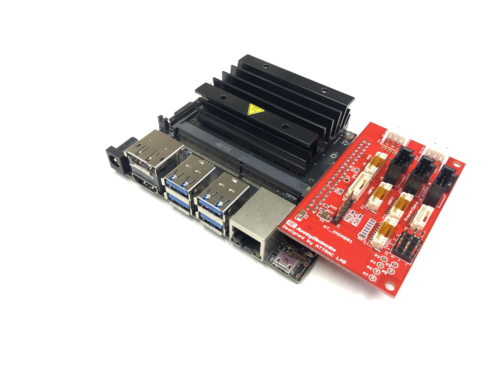
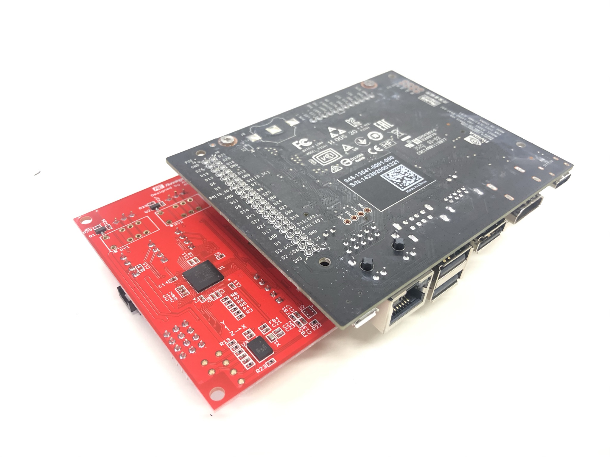

# JMOAB-ROS

This is a ros package for AT_JMOAB01 development shield on Jetson Nano/Xavier and Raspberry Pi for motor and I/O control.

## Install

Install smbus2 python module for i2c communication 
- `pip install smbus2`

Clone this repo to src directory of catkin workspace
- `cd ~/catkin_ws/src`
- `git clone https://github.com/rasheeddo/jmoab-ros.git`

Checking that your computer (Jetson or Pi) could detect this device
- `i2cdetect -y -r 1` then you should see a device address of 0x71

Build a package
- `cd ~/catkin_ws`
- `catkin_make`

Source environment
- `source ~/.bashrc`
- `source ~/catkin/devel/setup.bash`

## JMOAB with all nodes

`roslaunch jmoab-ros jmoab-ros.alunch` will run all the nodes that have implemented.

## JMOAB with ATCart Wheels

The board has an interface to send a command to control ATCart wheel system, it supports both regular 2-wheels or 4WD system. We need to have RC receiver which has SBUS functionality (Futaba as an example), and plug SBUS2 port from receiver to 4th row of J2 pin header. The board has failsafe function, if SBUS signal is lost, it will automatically switch itself to hold mode. We can change the mode by using ch5 on RC transmitter. Throttle is ch2 and steering is ch1, make sure to have correct direction control according to the transmitter's stick direction, otherwise just reverse the channel on your transmitter.

### Run

To run the jmoab_ros_atcart_node
- `rosrun jmoab-ros jmoab-ros-atcart.py`, 

List out topics
- `rostopic list`, you would see there are two topics got generated `/sbus_rc_ch` for publishing SBUS RC channel, and `/sbus_cmd` for subscribing a steering and throttle commands from your autopilot code.

Check more detail on example scripts
- `rosrun jmoab-ros sbus_ch_listener.py` for test reading sbus channel on a script
- `rosrun jmoab-ros sbus_cmd_sender.py` for test writing a command steering and throttle from a script

## JMOAB with BNO055 9axis IMU 

The default orientation of BNO055 on JMOAB is shown above. As default setup, we will have quaternion data in Fusion mode of IMU. In this mode we will get the data as relative from it firstly started.

### Run 
To run the jmoab_ros_imu_node
- `rosrun jmoab-ros jmoab-ros-imu.py`

List out topics
- `rostopic list`, you would see there is a topic `jmoab_imu_raw` which is geometry sensor message as quaternion.

So if you place the Jetson upside down (heatsink is pointing down), so there is no need to do dot product of rotation matrix. You can use that quaternion directly, but if your Jetson is placed regularly (heatsink is point up), then you will need to do dot product of rotation matrix. Please check the detail on example directory `imu_listener.py`

We can visualize the imu topic by using rviz_imu_plugin (install from here http://wiki.ros.org/rviz_imu_plugin). Then we could run rviz with the config file [here](rviz/jmoab-imu-test.rviz).

## JMOAB with BME680 sensor

...In development process

## JMOAB with F9P GPS

...In development process
