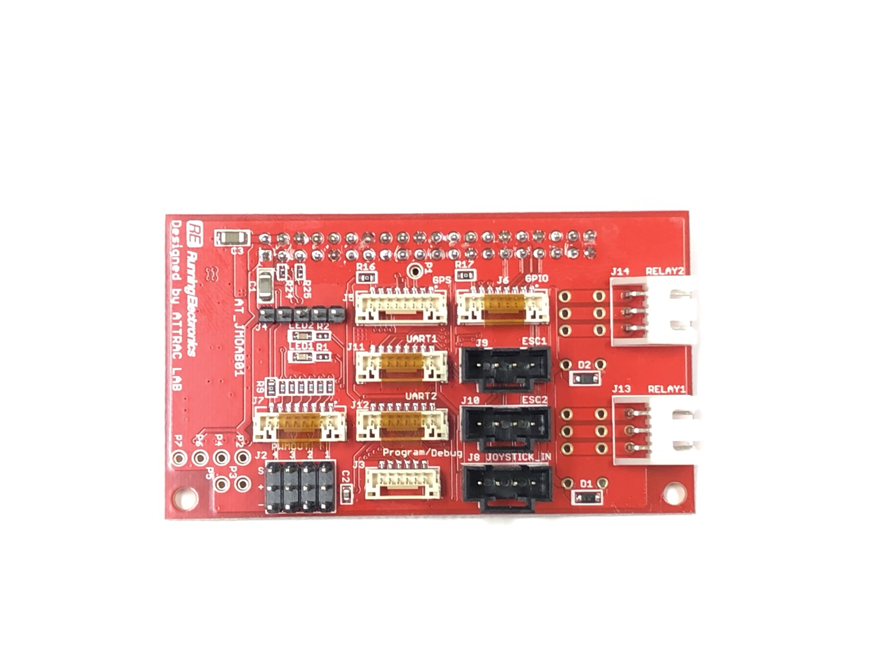
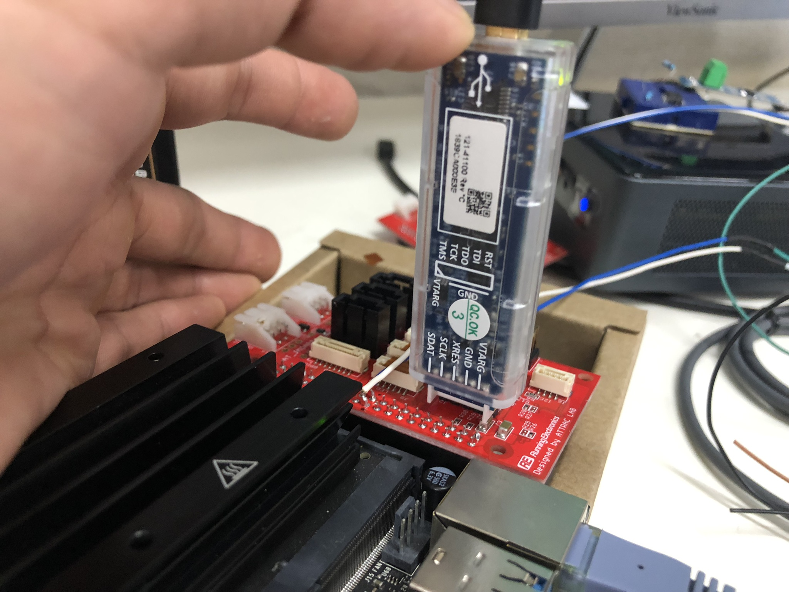

# JMOAB-ROS

This is a ros package for AT_JMOAB01 development shield on Jetson Nano/Xavier and Raspberry Pi for motor and I/O control.




## Install

Install smbus2 python module for i2c communication 
- `pip install smbus2`

Clone this repo to src directory of catkin workspace
- `cd ~/catkin_ws/src`
- `git clone https://github.com/rasheeddo/jmoab-ros.git`

Checking that your computer (Jetson or Pi) could detect this device
- For Jetson Nano, it's using i2c bus 1, so you could use this `i2cdetect -y -r 1` then you should see a device address of 0x71
- For Jetson Xavier NX, it's using i2c bus 8, so you could use this `i2cdetect -y -r 8` then you should see a device address of 0x71

Build a package
- `cd ~/catkin_ws`
- `catkin_make`

Source environment
- `source ~/.bashrc` 
- `source ~/catkin/devel/setup.bash`

***Note*** 
The default source code is for Jetson Nano for i2c bus 1, in case you want to use Jetson Xavier NX, you will need to change the i2c bus on [here](https://github.com/rasheeddo/jmoab-ros/blob/377d59f4a01cb1753efd727c44bf84528dd0e3e1/src/atcart_basic.py#L42) to 8. Similar with other jmoab nodes (bno055_ahrs.py, and etc.).

## Update JMOAB firmware

All of available firmware are in [firmwares](./firmwares/) directory.

To flash the firmware, please follow the step below, (must use Windows PC)

- first you will need to have Mini Prog3 [programmer](https://www.digikey.com/catalog/en/partgroup/psoc-miniprog3-programmer-debugger-cy8ckit-002/20080).

- Download PSocC Programmer [software](https://www.infineon.com/cms/en/design-support/tools/programming-testing/psoc-programming-solutions/?utm_source=cypress&utm_medium=referral&utm_campaign=202110_globe_en_all_integration-product_families#!downloads).

- Open the PSoC Programmer, it will shown as here


- Keep eyes on lower right corner, so it should show 3 green as PASS, POWERED, Connected. So you should plug the Mini Prog3 to the JMOAB J4 header for AT_JMOAB01 board or J2 header for other higher version. Make sure that the VTARG pin of the programmer is on the correct pin header on JMOAB. And also please power on the Jetson as well.



- Once you saw all three greens status, the select which firmware you would like to use, and click on Program button right next to Open button.

- If it's success, you will see the it's showing successful message.


- You will need to power off and on the Jetson again to take affect of new firmware on JMOAB.

## JMOAB with all nodes

`roslaunch jmoab-ros jmoab-ros.alunch` will run all the nodes that have implemented.


## JMOAB atcart_basic


The board has an interface to send a command to control ATCart wheel system, it supports both regular 2-wheels or 4WD system. We need to have RC receiver which has SBUS functionality (Futaba as an example), and plug SBUS2 port from receiver to 4th row of J2 pin header. The board has failsafe function, if SBUS signal is lost, it will automatically switch itself to hold mode. We can change the mode by using ch5 on RC transmitter. Throttle is ch2 and steering is ch1, make sure to have correct direction control according to the transmitter's stick direction, otherwise just reverse the channel on your transmitter.


### Run

`rosrun jmoab-ros atcart_basic.py`, 

#### Publisher

- `/jmoab/sbus_rc_ch` as std_msgs/Int16MultiArray type, the data is array of lenght 10, the value is as SBUS value from radio transmitter channels.
- `/jmoab/adc` as std_msgs/Float32MultiArray type, the data is array of lenght 6, as 10 bits ADC value from ANALOG port.
- `/jmoab/cart_mode` as std_msgs/UInt8 type, the data is cart mode; 0 = hold, 1 = manual, 2 = auto.

#### Subscriber

- `/cmd_vel` as geometry_msgs/Twist type, linear.x is considered as throttle value (go straight), angular.z is considered as steering value (curve or skidding). Maximum value is 2.0
- `/jmoab/wheels_cmd` as std_msgs/Float32MultiArray type, the data is array of lenght 2 as percentage of left/right wheels power, ex: [100.0, 100.0] full speed forward of left/right, [-100.0, -100.0] full speed backward of left/right.
- `/jmoab/cart_mode_cmd` as std_msgs/UInt8 type, the data is similar to `/jmoab/cart_mode`. We can send 0, 1 or 2 to change mode of the cart programmatically.
- `/jmoab/relays` as std_msgs/Int8MultiArray type, the data is array of lenght 2, ex: [1,0] => relay1 ON relay2 OFF.
- `/jmoab/servos` as std_msgs/Int16MultiArray type, the data is array of lenght 3, ex: [1920, 1120, 1520] => PWM1 high, PWM2 low, PWM3 mid.


## JMOAB with BNO055 9axis Orientation Sensor 

BNO055 could be connected to JMOAB on I2C port.

### Before Run

It's recommended to do a sensor calibration offset first. Please check on the step [here](docs/compass_calibration_step.md).

Once the compass is calibrated, the sensor offsets are saved into `calibration_offset.txt` at `example/` directory. So when you run `bno055_ahrs.py` it would load that automatically.

Depends on how you place BNO055 board on the cart, you will face that there is some "heading_offset" when you move the cart even as straight line, but the heading is pointing to other direction. 

To solve that heading offset issue, if your GPS can get RTK-Fixed status, I have added the "Kalman filter" to estimate the heading offset during the operation. So you will need to move the cart in manual mode as straight line as much as possible, find some good flat ground to run the bot in manual mode for this process. The Kalman filter is trying to estimate the true offset by using the bearing angle of two consequential GPS points, that why you need to get RTK-Fixed status to be able to use this. After a while of running in straight line you will notice that the bot's heading kept adjusted to the correct heading by itself. This estimation process could be done during auto mode as well, but it will do the estimation only when there is no steering motion.

Please check on [this video](https://youtu.be/MqF1ztsyBPM) for more explanation of this algorithms.

With NDOF_MODE, the BNO055 will have absolute heading, or if you need to reset heading everytime then comment [this line](https://github.com/rasheeddo/jmoab-ros/blob/377d59f4a01cb1753efd727c44bf84528dd0e3e1/src/bno055_ahrs.py#L254) and uncomment line under to use as IMU_MODE.

### Run

`rosrun jmoab-ros bno055_ahrs.py`

#### Publisher
- `/imu/data` as sensor_msgs/Imu type, the data is as linear acceleration, angular velocity and orientation in quaternion form.
- `/jmoab/ahrs` as std_msgs/Float32MultiArray type, the data is array of lenght 3 as [roll, pitch, heading] in degrees as East-North-Up frame.

#### Subscriber
- `/ublox/fix` as sensor_msgs/NavSatFix type, this is for true north heading calibration to know it's location.
- `/jmoab/sbus_rc_ch` as std_msgs/Int16MultiArray type, this is for true north heading calibration to recognize the cart is moving as straight line.
- `/jmoab/cart_mode` as std_msgs/UInt8 type, this is for true north heading calibration to recognize the cart is in manual or auto mode.

List out topics
- `rostopic list`, you would see there is a topic `jmoab_imu_raw` which is geometry sensor message as quaternion.

## JMOAB with F9P GPS

JMOAB has a GPS (UART) port which is connected to pin 8 and 10 of J41 header for `/dev/ttyTHS1` (UART_2).

In order to enable this port to use as regular user, please check on this [link](https://forums.developer.nvidia.com/t/read-write-permission-ttyths1/81623/6
) or following the step below.

- We will need to disable nvgetty

	```
	sudo systemctl stop nvgetty

	sudo systemctl disable nvgetty
	```

- Create a udev rule for ttyTHS* to get permission (without sudo)

	`sudo vim  /etc/udev/rules.d/55-tegraserial.rules`
	
- put this content on created udev rule file

	`KERNEL=="ttyTHS*", MODE="0666"`
	
- reload rules and reboot

	```
	sudo udevadm control --reload-rules

	sudo reboot
	```


If the GPS is plugging, then you could see a stream of NMEA or Ublox or both coming in this port.

I am using [this](https://www.sparkfun.com/products/15136) Ublox SparkFun F9P GPS, and fortunately there is an existing ROS package to parse this Ublox message and already pack it to `sensor_msgs/NavSatFix` for us to use, you can check it on KumarRobotics repo [here](https://github.com/KumarRobotics/ublox) and some setup [here](https://qiita.com/k-koh/items/8fd8ef6310e4f40fa536).

Once you clone that package, and did `catkin_make`. Next we need to change the content of config file on `ublox/ublox_gps/config/zed_f9p.yaml`. You can also make the new yaml file for your own. Then we have to put this content in to this file

```
device: /dev/ttyTHS1
frame_id: gps
uart1:
  baudrate: 115200
config_on_startup: false

publish:
  all: false
  nav:
    all: true
    relposned: true
    posllh: true
    posecef: true
```

Make sure you choose the correct baudrate according to your F9P Uart setup. If you don't know what is the baudrate of F9P's UART, you will need to check it with u-center software.

After everything is setup properly, and GPS is plugging on, we could start launch file to get GPS data with this command

`roslaunch ublox_gps ublox_device.launch node_name:=ublox param_file_name:=zed_f9p`

Make sure you specify the correct config file on `param_file_name`.

We could see the gps topic from `rostopic echo /ublox/fix`.

To visualize robot's GPS point and heading, please check on [this](docs/gcs.md).

To get a precise position, it's better to use RTK base station with F9P GPS. So please following a step below to install RTKLIB.

- `sudo apt-get install gfortran`

- `git clone https://github.com/tomojitakasu/RTKLIB.git`

- `cd RTKLIB`

- `git checkout rtklib_2.4.3`

- `cd lib/iers/gcc`

- `make`

- `cd ../../../app/consapp/str2str/gcc`

- `make`

You will get str2str binary file at `RTKLIB/app/consapp/str2str/gcc/`, so before using it please check the base station from [here](http://rtk2go.com:2101/SNIP::STATUS) where closed to your place.

To run RTKLIB, you need to plub USB cable from F9P's USB to Jetson, it should be recognized as `/dev/ttyACM0` or something similar, then we could run the str2str binary as,

	./str2str -in ntrip://rtk2go.com:2101/InohanaKobo -out serial://ttyACM0:115200 -b 1

You must change your base station place according to where the closet to your place, in my case it's `InohanaKobo`.

## JMOAB with Two F9P GPS for better a heading!

One GPS and one BNO055 could be enough to run waypoints autonomous driving, but two GPS with one BNO055 is the best!

The second GPS could be placed at the front of the cart to use as the reference point for heading offset calculation. 

Previously, on one GPS and one compass setup, we have to run the bot in manual to get enough data to let the Kalman filter estimates the correct heading offset. But with 2nd GPS on front, we could have a better heading offset estimated once we started `bno055_ahrs_2GpsRef.py` just in few seconds. So two GPS must have RTK-Fixed status, and the heading estimation will be done when the cart is moving as straight line or even at stationary.

Because there is only one UART on Jetson 40pins header, so we neeed to use USB port for the 2nd GPS. Please check on the wiring below.


Then we need to make a copy of `zed_f9p.yaml` file of ublox_gps node, I make the new one name as `zed_f9p_2.yaml`. The content inside is mostly the same except we need to change the device as

```
device: /dev/ttyUSB0
frame_id: gps
uart1:
  baudrate: 115200
config_on_startup: false

publish:
  all: false
  nav:
    all: true
    relposned: true
    posllh: true
    posecef: true
```

To run two ublox GPS with the same launch file, please using two terminals with these two commands

	roslaunch ublox_gps ublox_device.launch node_name:=ublox param_file_name:=zed_f9p

	roslaunch ublox_gps ublox_device.launch node_name:=ublox2 param_file_name:=zed_f9p_2

Your 1st GPS will have the namespace as `/ublox/` and the 2nd GPS will have `/ublox2/`. 

The USB port of F9P GPS when plugging on Jetson would be recognized as `/dev/ttyACMx`. In case of two GPS, you will have `/dev/ttyACM0` for GPS1 and `/dev/ttyACM1` for GPS2. We will need to use RTKLIB to get RTK-Fixed status for both ports.

	./str2str -in ntrip://rtk2go.com:2101/InohanaKobo -out serial://ttyACM0:115200 -b 1

	./str2str -in ntrip://rtk2go.com:2101/InohanaKobo -out serial://ttyACM1:115200 -b 1
