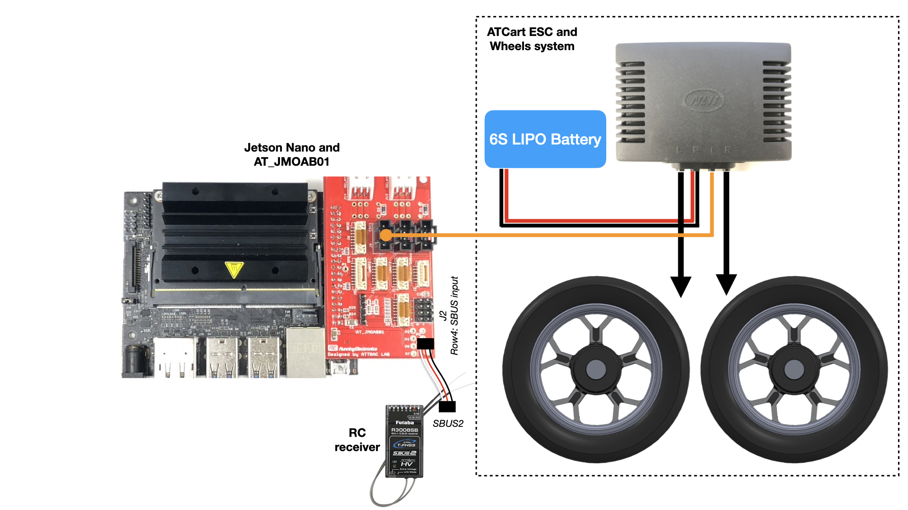
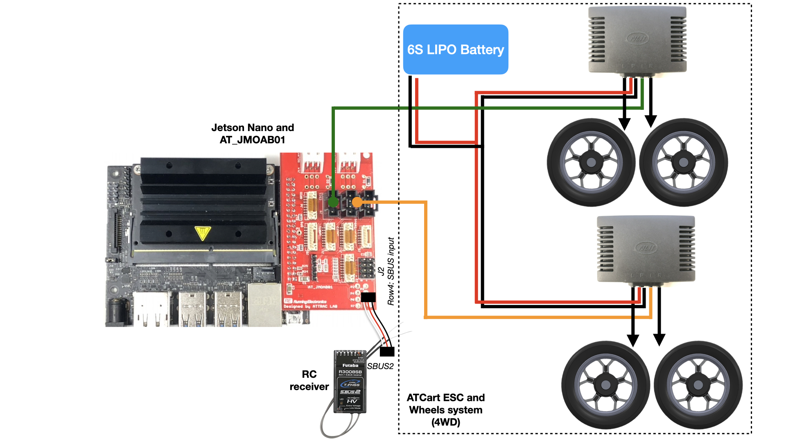

# JMOAB-ROS

This is a ros package for AT_JMOAB01 development shield on Jetson Nano/Xavier and Raspberry Pi for motor and I/O control.


## Install

Install smbus2 python module for i2c communication 
- `pip install smbus2`

Clone this repo to src directory of catkin workspace
- `cd ~/catkin_ws/src`
- `git clone https://github.com/rasheeddo/jmoab-ros.git`

Checking that your computer (Jetson or Pi) could detect this device
- For Jetson Nano, it's using i2c bus 1, so you could use this `i2cdetect -y -r 1` then you should see a device address of 0x71
- For Jetson Xavier NX, it's using i2c bus 8, so you could use this `i2cdetect -y -r 8` then you should see a device address of 0x71

Build a package
- `cd ~/catkin_ws`
- `catkin_make`

Source environment
- `source ~/.bashrc` 
- `source ~/catkin/devel/setup.bash`

## JMOAB with all nodes

`roslaunch jmoab-ros jmoab-ros.alunch` will run all the nodes that have implemented.

Note that the default source code is for Jetson Nano for i2c bus 1, in case you want to use Jetson Xavier NX, you will need to change the i2c bus on [here](https://github.com/rasheeddo/jmoab-ros/blob/3333073baad1f318b0c07b3825c5ef1e6c7bb01a/src/jmoab-ros-atcart.py#L14) to 8. Similar with other jmoab nodes (e.g. IMU).

## JMOAB with ATCart Wheels





The board has an interface to send a command to control ATCart wheel system, it supports both regular 2-wheels or 4WD system. We need to have RC receiver which has SBUS functionality (Futaba as an example), and plug SBUS2 port from receiver to 4th row of J2 pin header. The board has failsafe function, if SBUS signal is lost, it will automatically switch itself to hold mode. We can change the mode by using ch5 on RC transmitter. Throttle is ch2 and steering is ch1, make sure to have correct direction control according to the transmitter's stick direction, otherwise just reverse the channel on your transmitter.


### Run

To run the jmoab_ros_atcart_node
- `rosrun jmoab-ros jmoab-ros-atcart.py`, 

List out topics
- `rostopic list`, you would see there are two topics got generated `/sbus_rc_ch` for publishing SBUS RC channel, and `/sbus_cmd` for subscribing a steering and throttle commands from your autopilot code.

Check more detail on example scripts
- `rosrun jmoab-ros sbus_ch_listener.py` for test reading sbus channel on a script
- `rosrun jmoab-ros sbus_cmd_sender.py` for test writing a command steering and throttle from a script

### Using wheel's hall effect sensor for odometer

The ATCart wheel itself doesn't give a feedback of anything, in order to get RPM of the wheel we need to install extra sensor attaching on the wheel. Please check the detail on [here](docs/wheels_hall_sensor.md).


## JMOAB with BNO055 9axis Orientation Sensor 


The default orientation of BNO055 on JMOAB is shown above. As default setup, we will have quaternion data in Fusion mode of IMU. In this mode we will get the data as relative from it firstly started.

### Run as IMU mode
To run the jmoab_ros_imu_node
- `rosrun jmoab-ros jmoab-ros-imu.py`

List out topics
- `rostopic list`, you would see there is a topic `jmoab_imu_raw` which is geometry sensor message as quaternion.

So if you place the Jetson upside down (heatsink is pointing down), so there is no need to do dot product of rotation matrix. You can use that quaternion directly, but if your Jetson is placed regularly (heatsink is point up), then you will need to do dot product of rotation matrix. Please check the detail on example directory `imu_listener.py` for how to use convert quaternion to Euluer angle (roll-pitch-yaw), and `imu_repeater.py` to repeat the raw value and republish with some rotation matrix.

We can visualize the imu topic by using rviz_imu_plugin (install from here http://wiki.ros.org/rviz_imu_plugin). Then we could run rviz with the config file [here](rviz/jmoab-imu-test.rviz) and [here](rviz/jmoab-imu-repeater.rviz).

### Run as compass mode
To run BNO055 as compass mode on JMOAB, we need to calibrate the sensor offset first, please check on the step on this [link.](example/compass_calibration_step.md)


## JMOAB with ADC

There is Analog-to-Digital converter port where you can use to measure with some sensor devices or battery. The pin header is J7, you could check more detail on the doc [here](docs/AT_JMOAB01_sch201201.pdf). If you are using with ATCart wheel system, then your ESC cable should be plugged on ESC ports (J9 or J10). Then you can monitor the ESC's voltage on A5 channel of ADC.

### Run
To run the jmoab_ros_adc_node
- `rosrun jmoab-ros jmoab-ros-adc.py`

List out topics
- `rostopic list`, you will see there is a topic `jmoab_adc` which is Float32Array message, it contains 6 of voltage values from 6 ADC ports. 

## JMOAB with F9P GPS

JMOAB has a GPS (UART) port which is connected to pin 8 and 10 of J41 header for `/dev/ttyTHS1` (UART_2).

In order to enable this port to use as regular user, please check on this [link](https://forums.developer.nvidia.com/t/read-write-permission-ttyths1/81623/6
) or following the step below.

- We will need to disable nvgetty

	```
	sudo systemctl stop nvgetty

	sudo systemctl disable nvgetty
	```

- Create a udev rule for ttyTHS* to get permission (without sudo)

	`sudo vim  /etc/udev/rules.d/55-tegraserial.rules`
	
- put this content on created udev rule file

	`KERNEL=="ttyTHS*", MODE="0666"`
	
- reload rules and reboot

	```
	sudo udevadm control --reload-rules

	sudo reboot
	```


If the GPS is plugging, then you could see a stream of NMEA or Ublox or both coming in this port.

I am using [this](https://www.sparkfun.com/products/15136) Ublox SparkFun F9P GPS, and fortunately there is an existing ROS package to parse this Ublox message and already pack it to `sensor_msgs/NavSatFix` for us to use, you can check it on KumarRobotics repo [here](https://github.com/KumarRobotics/ublox) and some setup [here](https://qiita.com/k-koh/items/8fd8ef6310e4f40fa536).

Once you clone that package, and did `catkin_make`. Next we need to change the content of config file on `ublox/ublox_gps/config/zed_f9p.yaml`. You can also make the new yaml file for your own. Then we have to put this content in to this file

```
device: /dev/ttyTHS1
frame_id: gps
uart1:
  baudrate: 115200
config_on_startup: false

publish:
        all: false
        nav:
                all: true
                relposned: true
                posllh: true
                posecef: true
```

Make sure you choose the correct baudrate according to your F9P Uart setup. If you don't know what is the baudrate of F9P's UART, you will need to check it with u-center software.

After everything is setup properly, and GPS is plugging on, we could start launch file to get GPS data with this command

`roslaunch ublox_gps ublox_device.launch node_name:=ublox param_file_name:=zed_f9p`

Make sure you specify the correct config file on `param_file_name`.

We could see the gps topic from `rostopic echo /ublox/fix`.

To visualize robot's GPS point and heading, please check on [this](example/gcs.md).

To get a precise position, it's better to use RTK base station with F9P GPS. So please following a step below to install RTKLIB.

- `sudo apt-get install gfortran`

- `git clone https://github.com/tomojitakasu/RTKLIB.git`

- `cd RTKLIB`

- `git checkout rtklib_2.4.3`

- `cd lib/iers/gcc`

- `make`

- `cd ../../../app/consapp/str2str/gcc`

- `make`

You will get str2str binary file at `RTKLIB/app/consapp/str2str/gcc/`, so before using it please check the base station from [here](http://rtk2go.com:2101/SNIP::STATUS) where closed to your place.

To run RTKLIB, you need to plub USB cable from F9P's USB to Jetson, it should be recognized as `/dev/ttyACM0` or something similar, then we could run the str2str binary as,

	`./str2str -in ntrip://rtk2go.com:2101/InohanaKobo -out serial://ttyACM0:115200 -b 1`

You must change your base station place according to where the closet to your place, in my case it's `InohanaKobo`.

## JMOAB with DJI Ronin-SC control

DJI Ronin-SC handheld camera stabilizer is DSLR camera gimbal. It could be remotely operated by RC transmitter with SBUS signal. For more detail how, please check on this [video](https://www.youtube.com/watch?v=fCnYqv7fR_c&ab_channel=Mad%27sTech). 

In order to let the Jetson control the gimbal, we need to use a special JMOAB firmware (v07e_20210805_AT_JMOAB01&03_SBUSOUT.hex) which able to control ATCart wheels and also SBUS output on SBUS3 port.

We need to use `jmoab-ros-atcart-gimbal.py` to control the cart and gimbal.

There is still `/sbus_cmd` topic which going to receive sbus steering and throttle commands similar to normal `jmoab-ros-atcart.py`, and we have new topics as `/sbus_gimbal_cmd` which is the speed of pan and tilt of gimbal. For example, sending `[1680, 1024]` on this will make the gimbal panning in full speed, or `[1024, 1680]` will make the gimbal tilting in full speed. And there is `/gimbal_recenter` which is a boolean topic to recenter the gimbal back to home position. Send `True` to recenter the gimbal, and only needs one time (not continuous).


To publish custome topics for debugging, please check on this [rqt_ez_publisher package](http://wiki.ros.org/rqt_ez_publisher).

## JMOAB with BME680 sensor

...In development process


